# Engineering and Delivery Master Plan

## 1. Mission

Deliver a production-capable mobile-first SaaS for independent hotels, hostels and guest houses in India. The system combines property operations, room/bed inventory, stays and finance, QR service workflows, WhatsApp communications and curated local concierge services.

The engineering priority order is locked:

1. Tenant isolation and financial correctness.
2. No double booking of any room or bed.
3. Mobile usability on low-cost Android devices.
4. Simple workflows for non-technical staff.
5. WhatsApp-first guest communication without making WhatsApp a PMS dependency.
6. Maintainability and low operating cost.

## 2. Product boundaries

### MVP includes

- Multi-organization and multi-property management.
- Multiple roles per person at organization and property scopes.
- Room, whole-room and individual-bed inventory.
- Reservations, stays, folios, payments, expenses and cash closing.
- Private KYC storage and audited access.
- Secure QR guest portal and shared-device staff operations.
- Meta WhatsApp Cloud API integration, shared inbox and handover.
- City content, service enquiries and manual commission records.
- Plan entitlements, trial/grace/read-only states and platform administration.

### MVP explicitly excludes

Native apps, OTA/channel manager integrations, SMS, guest email workflows, AI chatbot, automated vendor settlement, payroll/full ERP, smart locks, public API marketplace, advanced dynamic pricing and unlimited WhatsApp bundles.

## 3. Delivery operating model

- **Vertical slices:** each milestone crosses UI, domain, database, authorization, audit, tests and mobile verification.
- **Architecture before scale:** use a modular monolith until operational evidence justifies service extraction.
- **Database as final invariant boundary:** RLS, constraints and transactions remain effective even if application filtering fails.
- **Evidence-based completion:** screenshots alone do not prove completion; acceptance tests and negative authorization tests do.
- **Reversible delivery:** schema changes are migrations; business records use state transitions/reversals rather than deletion.
- **Change control:** locked decisions require a superseding ADR approved by product owner and technical lead.
- **Approval record:** M0 is approved after actor identity, multilingual scope, authorization precedence, tenant lifecycle, invitation security and account recovery decisions were incorporated and O-01–O-05/O-20–O-24 were accepted.

## 4. Governance and ownership

| Responsibility | Accountable role | Required evidence |
|---|---|---|
| Product scope and pilot workflow | Product owner | Signed decision log and pilot validation notes |
| Architecture and data invariants | Technical lead | ADRs, migration review and threat model |
| Authorization/RLS | Security owner + database lead | Positive/negative matrix and cross-tenant tests |
| Mobile usability | Product/design lead | Required-width evidence and pilot task timing |
| Financial correctness | Product owner + technical lead | Calculation, tamper and reversal tests |
| Release approval | Product owner + technical lead | Milestone exit report with zero open critical findings |

## 5. Architecture principles

1. Server Components are preferred for authenticated reads; client components are interaction islands.
2. Server Actions handle first-party UI mutations; Route Handlers handle webhooks and external/public HTTP contracts.
3. Node.js runtime is the default for database, crypto, PDF and integration work.
4. Supabase browser access uses only publishable credentials and RLS-safe operations.
5. Privileged server operations are narrow, audited and never a workaround for missing RLS.
6. Authenticated pages that may refresh sessions are dynamic and must not leak cached `Set-Cookie` responses.
7. Money is stored as integer minor units with ISO currency; totals are recomputed server-side.
8. Timestamps use UTC `timestamptz`; property-local business dates are explicit date fields.
9. External calls never occur while inventory/financial database locks are held.
10. WhatsApp webhook ingest is signature-verified, deduplicated, acknowledged quickly and processed asynchronously.
11. Critical audit events are written in the same transaction as their business mutation; external notifications use the outbox and never gate audit persistence.
12. Command idempotency rejects reuse of the same key with a different canonical request hash.
13. Static product translations are version-controlled; tenant content translations use typed parent tables and English fallback. No runtime translation API is part of MVP.

## 6. Work stages and gates

```mermaid
flowchart LR
  M0["M0: Architecture approval"] --> M1["M1: Identity and tenancy"]
  M1 --> M2["M2: Inventory and bookings"]
  M2 --> M3["M3: Stay and finance"]
  M3 --> M4["M4: QR operations"]
  M4 --> M5["M5: WhatsApp"]
  M5 --> M6["M6: Concierge"]
  M6 --> M7["M7: Billing and production"]
  M1 -. "RLS proof" .-> M2
  M2 -. "collision proof" .-> M3
  M4 -. "safe guest boundary" .-> M5
```

Each gate requires: scope outcome, migrations, authorization/RLS evidence, tests, mobile verification, security findings, limitations and next milestone.

## 7. Project controls

- Maintain a decision log, risk register, dependency register and acceptance traceability matrix.
- Estimate only after M0 decisions and pilot workflow review.
- Use one milestone branch/PR sequence with small reviewable diffs.
- Require security review on every meaningful authorization, webhook, storage or finance diff.
- Stop a milestone when a foundational invariant cannot be proven; do not hide it behind a known limitation.

## 8. Success measures

### Product

First-property setup time, first-booking time, booking/check-in completion, room/bed collision rate (target zero), housekeeping turnaround, guest-request SLA, cash variance, WhatsApp automation resolution/handover and multi-property expansion.

### Engineering

Cross-tenant test coverage, escaped authorization defects, rollback success, migration duration, failed webhook retries, dead-letter age, PWA reliability on target Android devices, Core Web Vitals and restore-test success.

## 9. Exit decision for M0

M0 is **Approved**. M1 may begin as the documented identity-and-tenancy vertical slice. O-06 onward remains milestone-gated and O-25 is required before M2/M3.
