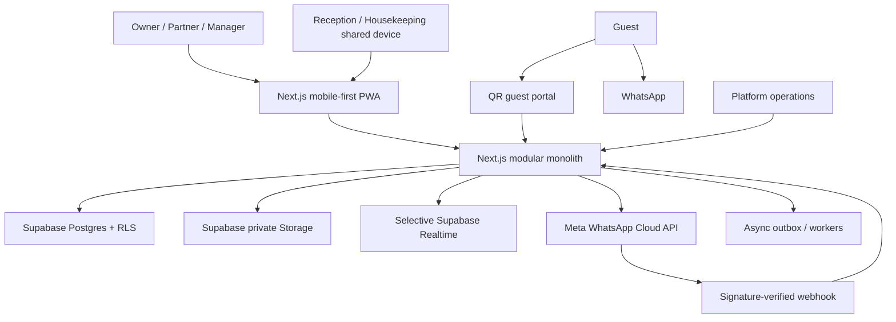
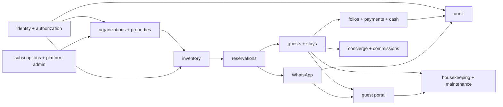
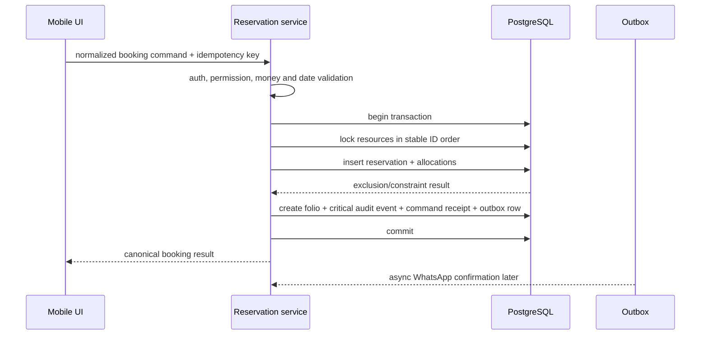

# System Architecture

## 1. Context

## 2. Deployable architecture

Use one Next.js application and one Supabase project per environment. Modules share the deployment and database but own domain services, schemas/queries, validation, tests and audit events. No cross-module mutation occurs by importing UI code or directly modifying another module's tables without a documented service/database contract.

### Runtime boundaries

| Concern | Preferred boundary |
|---|---|
| Authenticated page reads | Server Components calling server-only data services |
| First-party form mutations | Server Actions → authorization → domain service → transaction |
| External webhooks/public APIs | Route Handlers with explicit HTTP contracts |
| Interactive UI/realtime subscriptions | Small Client Components receiving serializable data |
| PDF/invoice/media processing | Node.js server runtime/background worker |
| Scheduled/retry work | Durable outbox consumer; provider selected later |

Never trust a Server Action merely because it originated from the UI. Every mutation repeats authentication, tenant scope, permission, validation and invariant checks server-side.

## 3. Module map

## 4. Tenant request flow

1. Validate the Supabase session/claims on the server.
2. Resolve organization/property from stable slug or UUID.
3. Confirm active membership; never infer access from URL presence.
4. Compute effective permissions from roles, scope, explicit deny/allow and limits.
5. Execute through RLS under the caller where possible.
6. For privileged functions, validate `auth.uid()` internally, set an empty search path, keep them in a non-exposed schema and minimize grants.
7. Write an audit event for sensitive mutation with actor, effective scope, reason and correlation ID.

Actor identity is unified for audit but not for credentials: Google-authenticated management profiles and property-local operational staff records both reference an auditable actor. Guest actors are short-lived and stay/session scoped so shared-room privacy and retention remain bounded.

## 5. Booking transaction

External messaging/payment calls never run inside the inventory transaction.

Critical audit persistence remains inside the same transaction as the business mutation. The outbox carries only external notifications/async work; worker failure cannot erase or delay the authoritative audit record.

## 6. Authentication architecture

- Management identities use Supabase Auth with Google OAuth and PKCE/cookie-based SSR.
- Store application authorization in database memberships, not user-editable metadata.
- Use server-verified claims/user state; session presence alone does not grant tenant access.
- Shared-device mode starts from a manager-established property session. A PIN selects an accountable limited staff identity and policy profile within that property.
- Recent Google re-authentication or an approval workflow is required for ownership, high-value finance, export and subscription operations.
- Authenticated/session-refreshing responses must not be cached publicly or by ISR.

## 7. Integration architecture

### WhatsApp

Inbound: verify handshake/signature → persist raw event identity/hash → acknowledge quickly → process asynchronously → resolve number/tenant → upsert messages/state → route bot/human → emit UI event.

Outbound: create outbox command with tenant, template/session category and idempotency key → enforce usage/caps → provider adapter sends → status webhooks update ledger → bounded retry → dead letter.

### Storage

Private buckets by data class: KYC, receipts, maintenance media and tenant branding. Database rows hold ownership/scope and storage object path. Signed URLs are short-lived and created only after server authorization. Public guest content is physically/logically separated from private stay material.

## 8. Observability

Every request/job carries correlation ID, actor mode, organization and property. Logs must never contain raw documents, access/refresh tokens, app secrets or full WhatsApp payloads unless a redacted controlled diagnostic workflow explicitly permits it.

Required signals: auth failures, RLS denials, booking constraint conflicts, webhook verification/replay, retry/dead-letter age, signed URL issuance, financial reversals, permission changes, shared-device lockouts and backup/restore health.

## 9. Identity recovery and invitations

High-privilege owner/partner/manager invitations remain pending after Google login until the inviter (or required second approver) confirms the claimed Google identity. Forwarding a token cannot activate membership by itself. Operational staff enroll under manager supervision on an authorized shared device.

Recovery uses an explicit case workflow. Normal Google access uses normal login; loss of one owner's Google access requires another verified owner approval; sole-owner recovery requires platform business verification, independent approval, cooling period, notification, session/device revocation and temporary block on ownership/billing actions. Support cannot directly replace ownership outside this workflow.
