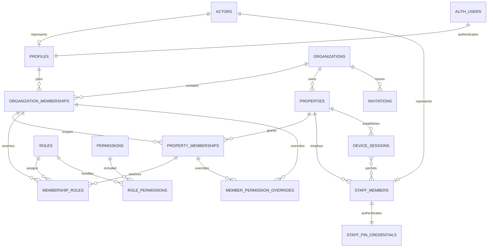
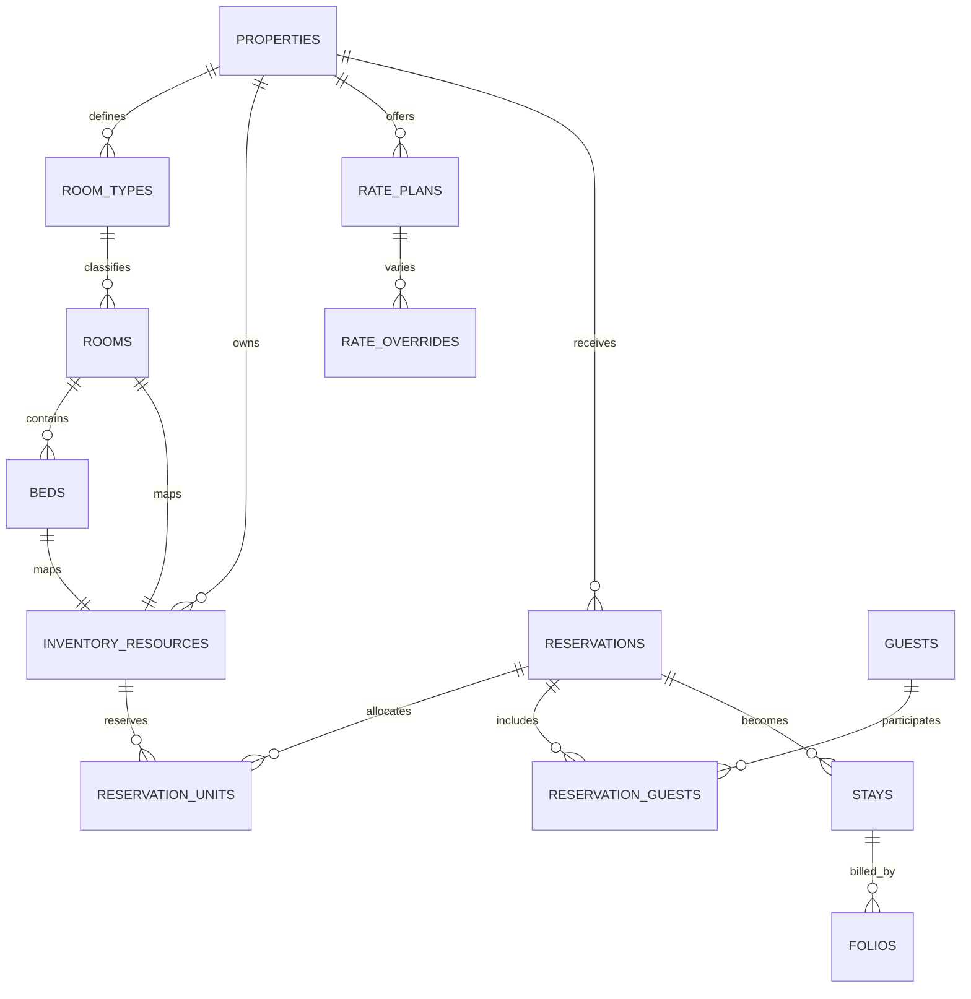
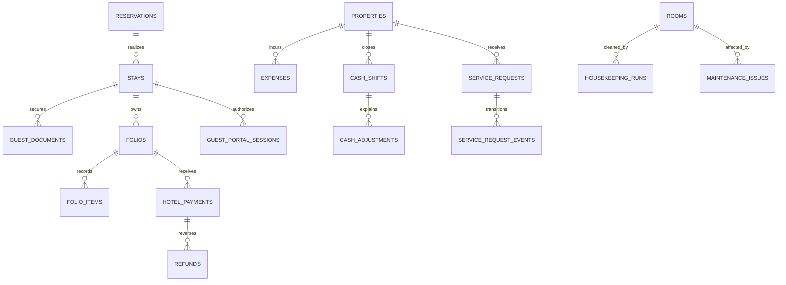

# Data Model Proposal

Status: logical M0 proposal; migration SQL begins in M1.  
Conventions: UUID primary keys, lowercase identifiers, `timestamptz` for instants, `date` for property-local business dates, integer minor units for money, explicit status constraints and indexed foreign keys.

## 1. Schema ownership

| Schema | Purpose | Exposure |
|---|---|---|
| `public` | Tenant application records intended for controlled Data API access | RLS required; explicit grants only |
| `private` | Authorization helpers, secrets metadata, privileged coordination | Not exposed; execute granted narrowly |
| `audit` | Append-only security/business audit stream | Server/auditor reads only |
| `billing` | SaaS plans, subscriptions, entitlements and platform payments | Platform/authorized tenant reads only |

Supabase's current Data API behavior requires explicit exposure/grants for new tables. Grants and RLS are separate controls and both must be reviewed.

## 2. Core tenancy ERD

### Key decisions

- `actors` is the auditable identity abstraction. `actor_type` distinguishes management user, operational staff and platform user.
- `profiles.id` equals `auth.users.id` and references one management actor.
- `staff_members` is a property-scoped operational identity without requiring a Google account. Its PIN credential belongs to the staff member/property; the device session only authorizes a managed hotel device to host eligible staff sessions.
- Guest actions use a short-lived, stay-scoped actor reference owned by `guest_portal_sessions`; guests are not promoted into permanent management-style actors. Retention can remove/rotate the scoped actor without harming tenant audit integrity.
- Membership status (`invited`, `active`, `suspended`, `revoked`) is checked on every access.
- Organization roles and property roles are distinct assignments; a single polymorphic membership-role table is acceptable only with strict check constraints, otherwise use two explicit join tables.
- Authentication ceiling applies first. Within applicable scope, explicit deny permanently wins over every role/override allow. Explicit allow cannot override a deny or elevate a shared-device PIN into sensitive permission families.
- Approval limits are typed records (`limit_key`, `currency_code`, `minor_units` or `percentage_basis_points`) rather than unvalidated JSON.

## 3. Inventory and booking ERD

### Canonical resource model

`inventory_resources` represents allocatable units with `resource_kind` = `room` or `bed`. Each room and bed maps one-to-one to a resource. A bed resource references its containing room resource.

To prevent a whole-room allocation from overlapping any bed allocation, maintain a normalized `resource_conflicts(resource_id, conflicts_with_resource_id)` closure including self-conflicts and room↔bed conflicts. Reservation allocation expands to conflict keys inside the same transaction. Active allocation ranges use half-open property-local stay dates `[check_in_date, check_out_date)`.

The migration design must prove one of these database-enforced implementations before M2 approval:

1. Materialized conflict-slot rows protected by an exclusion constraint on `(conflict_resource_id WITH =, stay_range WITH &&)` for active allocations; or
2. A reviewed transactional function that locks all room/bed resources in stable UUID order, checks conflicting active ranges and inserts atomically, with a concurrency test proving only one winner.

Preferred: option 1 when PostgreSQL constraint mechanics fit the final schema; option 2 only with strong transaction tests and retry semantics. Frontend availability checks never count as protection.

## 4. Stay, finance and operations

### Financial invariants

- `amount_minor bigint`, `currency_code char(3)`; never floating point.
- A folio item has immutable source, amount, tax breakdown, effective business date and reversal link.
- Posted payments/refunds require idempotency keys unique within provider/property scope.
- Corrections create reversing/adjusting records; posted records cannot be hard-deleted.
- Client-submitted totals are ignored; the server recalculates from canonical rates, taxes, discounts and limits.
- Invoice numbers are unique per property and fiscal series, allocated transactionally.
- Cash shifts close once; reopening requires privileged approval and an audit event.

## 5. QR and shared-device model

- QR records store a high-entropy token hash, purpose, property/resource scope, rotation state and expiry—not sequential public IDs.
- Public property content is readable without stay identity; private actions require a valid short-lived guest portal session bound to stay and allowed resource.
- Shared-device sessions are manager-established, property-bound, expiring and revocable.
- Staff PIN verifiers are slow-hashed with per-record salt/parameters, lockout counters and rate-limit state. PIN values are never logged.

## 6. WhatsApp model

Core tables: connections, phone numbers, contacts, conversations, messages, message events, assignments, templates, automation rules, webhook events, bot states, outbox commands, usage ledger and dead letters.

Required uniqueness:

- `(connection_id, provider_event_id)` for webhook replay protection.
- `(connection_id, provider_message_id)` where non-null.
- `(organization_id, idempotency_key)` for outbound commands.
- One active routing owner for a phone number at a time.

Raw webhook bodies are retained only for a short configured diagnostic window, encrypted/limited where appropriate, with redacted long-term event metadata.

## 7. Localization model

Static application/navigation/error text uses version-controlled locale catalogs. Launch locales proposed by O-20 are Hindi, English, French, Spanish, German and Russian; optional property packs are Japanese, Thai, Sinhala and Korean. No runtime machine-translation API is included in MVP.

Tenant-configurable database content uses typed translation tables—such as `service_request_type_translations`, `property_content_translations` and `concierge_item_translations`—with real parent foreign keys and unique `(parent_id, locale)` constraints. Avoid one polymorphic `content_translations` table that would weaken foreign keys and complicate RLS.

Translation rows include publication state (`draft`, `reviewed`, `published`, `archived`), `source_locale`, `translation_version`, `reviewed_by_actor_id`, `reviewed_at` and `content_hash`. Guest-facing resolution and English fallback read only published content; missing or unfinished translations are not exposed.

Locale configuration includes `supported_locales`, `organization_locales`, `property_locales`, `guest_locale_preferences` and `whatsapp_template_locales`. Resolution order is platform default → organization override → property override → English fallback. Every translated record has source/review/version metadata.

## 8. Concierge and SaaS billing

City content follows platform template → organization override → property override. Overrides reference their source/version so updates can be reviewed instead of silently overwriting tenant edits.

Manual commissions model expected, received, partial, disputed and waived states with immutable history. Vendor payable is separate from hotel commission to avoid conflating liabilities and revenue.

Plan entitlements are evaluated server-side from subscription state, plan limits, feature flags and the tenant access lifecycle. Access states are `trial`, `active`, `past_due`, `grace`, `read_only`, `suspended` and `closed`.

In `read_only`, existing guest checkout, existing-folio reconciliation, approved refund/reversal, owner export and emergency/public QR remain available. New booking is blocked; new check-in is allowed only through an explicit grace configuration; configuration/member changes are blocked. This exception matrix is a policy contract, not a UI convenience.

Security `suspended` is distinct from billing `read_only`: tenant management access is blocked and only platform-controlled emergency/recovery rules apply. The suspension record stores reason, prior safe state and approval metadata so restoration never blindly selects a state.

Export, deletion and legal hold are orthogonal workflows, not tenant-access states:

- Export request: `requested`, `processing`, `ready`, `downloaded`, `expired`, `failed`.
- Deletion request: `requested`, `cooling_period`, `approved`, `blocked_by_legal_hold`, `processing`, `completed`, `cancelled`.
- Legal hold: `inactive`, `active`, `released`.

An export request never changes tenant permissions. Active legal hold blocks deletion processing but does not silently alter access state.

### Tenant access transition matrix

| From | To | Condition |
|---|---|---|
| Trial | Active | Subscription/payment activated |
| Active | Past due | Renewal/payment failed |
| Past due | Grace | Configured grace begins |
| Grace | Active | Payment recovered |
| Grace | Read only | Grace expired |
| Read only | Active | Payment recovered |
| Any non-closed state | Suspended | Security/policy action |
| Suspended | Previous safe state | Platform approval and current eligibility recheck |
| Read only | Closed | Owner closure process complete |
| Closed | Active | Approved restoration inside configured restoration window |

## 9. Command receipts, audit and outbox

`command_receipts` provides generic idempotency for reservation creation, invitation acceptance, check-in/out, service requests, housekeeping completion, expenses and QR activation. Key fields: organization/property scope, operation, idempotency key, canonical request hash, status, result type/id, safe response snapshot and expiry. Same key + different hash returns a conflict and never reuses the earlier result.

Critical audit events are inserted in the same database transaction as the sensitive business mutation. Audit is never deferred to or dependent on an outbox worker. Audit payloads contain approved safe field summaries only—never KYC, access/refresh tokens, PIN hashes, full WhatsApp payloads or payment secrets.

`outbox_events` handles external notifications and asynchronous work with correlation/idempotency key, event type/version, safe payload, attempt count, next-attempt time, state and dead-letter reason.

## 10. Index plan

All foreign keys are indexed. Initial composite/partial candidates:

- Active membership lookup: `(user_id, organization_id)` where status = `active`.
- Property scope: `(organization_membership_id, property_id)` where status = `active`.
- Reservations: `(property_id, check_in_date, check_out_date)` with active-status partial index.
- Booking search: normalized guest phone/name/code with property scope.
- Service work queue: `(property_id, status, priority, created_at)` for open states.
- WhatsApp inbox: `(phone_number_id, status, last_message_at desc)`.
- Webhook dedupe: unique `(connection_id, provider_event_id)`.
- Audit: `(organization_id, property_id, occurred_at desc)` and actor/date.

Index choices must be validated against real query plans; speculative indexes are not added wholesale.

## 11. RLS pattern

Every exposed table has explicit grants and RLS. Policies use `TO authenticated` plus membership/scope predicates; `TO authenticated` alone is never authorization. Update policies include both `USING` and `WITH CHECK`. Columns used by policies are indexed. Views are security-invoker or private.

Authorization helpers:

- are small and auditable;
- reside in `private`;
- validate `(select auth.uid())` internally when security-definer behavior is essential;
- set `search_path = ''`;
- revoke default `PUBLIC` execute and grant only what policies/callers need.

## 12. Migration sequence

1. Schemas, extensions and common types.
2. Actors, management profiles, operational staff, tenancy tables and grants.
3. Roles/permissions/limits and helpers.
4. Properties/inventory resources.
5. Reservations and collision protection.
6. Guests/stays/storage metadata.
7. Command receipts, transaction-bound audit, finance controls and outbox.
8. Operations/QR.
9. WhatsApp/outbox.
10. Typed localization, concierge and billing lifecycle.

Each migration batch ends with schema lint/advisors, positive and negative RLS tests, rollback/forward strategy and a local database reset verification.
