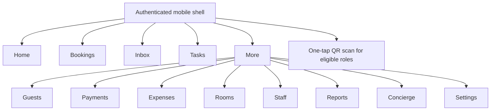
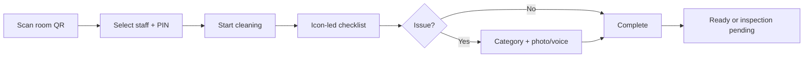

# Mobile Information Architecture and Core Flows

Status: behavioral IA, not a selected visual design. A separate product-design pass will produce three visual directions before any UI implementation.

## 1. Navigation model

Bottom navigation remains `Home | Bookings | Inbox | Tasks | More`. Organization/property switching is persistent context, not a buried settings action. Every screen visibly shows the effective property when an action has operational or financial impact.

## 2. Persona-specific home priorities

| Persona | First information | Primary action |
|---|---|---|
| Organization owner | Multi-property exceptions, occupancy, cash and overdue work | Switch/drill into property |
| Property manager | Arrivals, departures, room readiness, unresolved requests | Resolve highest-risk exception |
| Receptionist | Today's arrivals/departures, vacant/dirty units, balances | New booking/check-in |
| Housekeeper | Assigned/priority rooms and elapsed time | Scan/start cleaning |
| Maintenance | Open blocked rooms and priority issues | Start/update issue |
| Accountant | Pending approvals, shifts and variances | Review/close |
| Concierge | Enquiries, bookings and content freshness | Respond/update |

No persona receives a generic dashboard full of irrelevant modules.

## 3. Core owner onboarding

Target: 20–30 minutes for a small property. Progress is resumable; every step has skip/defer rules that do not produce an unusable property.

## 4. Reservation flow

1. Search availability by property-local dates, party and room/bed mode.
2. Show available cards with canonical total, restrictions and source.
3. Select one or multiple resources.
4. Add/identify primary guest using normalized mobile number; guest email absent.
5. Confirm rates, taxes, discount reason/limit, hold/confirm state and source.
6. Server revalidates and allocates transactionally.
7. Success shows booking code, assigned resources, balance and WhatsApp send status.
8. Conflict returns to availability with a clear “inventory changed” recovery—not a generic error.

## 5. Check-in and checkout

Check-in: booking verification → guest/co-guest details → optional KYC camera capture → payment/deposit → resource readiness → stay activation → WhatsApp welcome/QR access.

Checkout: review folio → correct via explicit adjustment → collect/split payment or refund → confirm irreversible effects → generate invoice → expire guest private access → mark vacated units dirty.

Financial confirmation always shows amount, currency, property and consequence.

## 6. Housekeeping flow

The screen uses large targets, property-selected default locale, minimal typing, visible pending-sync state and no financial/navigation clutter. Target usability exit: a non-technical staff member completes a normal clean in under 90 seconds excluding physical cleaning time.

## 7. Guest QR information architecture

Public: property identity, reception/emergency, Wi-Fi/public amenities as configured, city guide and safe request initiation.

Private after stay verification: current stay summary, running bill, extension/checkout request and guest-specific service history. In shared rooms, never reveal other occupants or resource allocation details.

Top-level guest portal: `Need Help | My Stay | Hotel Services | Explore City | Book Experiences | Reception | Emergency`.

## 8. Required UI states

Every operational screen defines loading skeleton, empty state, recoverable error, permission denied, stale/conflict state, offline state and success confirmation. Long forms auto-save drafts where safe. Offline states distinguish “saved on device” from “confirmed by hotel.”

## 9. Responsive/accessibility acceptance

- Verify 320, 360, 390 and 430 px widths; no horizontal page scroll.
- Minimum 44 px touch targets and visible focus.
- Mobile tables become cards/lists with preserved labels.
- Status uses text/icon/shape in addition to color.
- Launch UI catalogs cover Hindi, English, French, Spanish, German and Russian; optional property packs cover Japanese, Thai, Sinhala and Korean after content approval.
- Resolution is platform default → organization override → property override → English fallback. Static UI strings live in version-controlled catalogs; no runtime translation API is used in MVP.
- Layout tests include long German/Russian text, Devanagari glyphs and locale-specific number/date formatting without hardcoded component strings.
- Amount/PIN inputs request appropriate keyboards; ID capture supports camera.
- Primary action is obvious and optionally sticky without hiding content.
- Destructive actions are never swipe-only.

## 10. Visual design gate

Before UI code, establish a small source set (brand/market references or explicit direction), generate exactly three mobile visual directions, select one with the product owner, then implement and compare at target viewports. M0 deliberately does not invent a palette, typography personality or card style.
