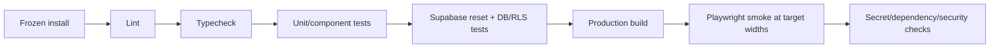

# Repository and Engineering Foundation Plan

## 1. Initial repository state

The coding workspace contained no application repository at M0 review time. Only `work/` and `outputs/` existed. No existing code, package manager, Git history, Supabase configuration or CI was modified.

## 2. Proposed structure

```text
apps/
  web/
    src/app/                  Next.js App Router routes
    src/components/           cross-feature view components
    src/features/             feature UI and application adapters
    src/lib/                  Supabase clients, logging, config
packages/
  ui/                         design primitives after visual approval
  domain/                     pure domain types/rules
  validation/                 shared Zod schemas
  config/                     lint, TypeScript and environment contracts
supabase/
  migrations/
  tests/
  seed.sql
docs/
  adr/
  data-model.md
  permissions-matrix.md
  test-plan.md
  runbook.md
  threat-model.md
```

Use a pnpm workspace because the specification already has real shared boundaries. Avoid further apps/services until evidence requires them.

## 3. Route plan

```text
/auth/*
/app/[organizationSlug]/[propertySlug]/*
/q/[token]
/api/v1/whatsapp/webhook
/api/v1/integrations/*
/platform-admin/*
/dev/ui                     non-production internal component gallery
```

Use Next.js 16+ `proxy.ts` for session refresh/routing support, not as the authorization boundary. Authorization remains in server/domain/database checks.

## 4. Server/client rules

- Pages/layouts are Server Components by default.
- Client Components exist only for interaction, browser APIs, realtime and optimistic state.
- Async Client Components are prohibited.
- Data crossing server/client boundaries is serializable DTO data.
- UI mutations call narrow Server Actions; external integrations call Route Handlers.
- Domain services receive explicit actor/scope context and return typed results.
- The Supabase service/secret key is never a browser variable and never used to make ordinary tenant UI work.

## 5. Environments and secrets

| Environment | Purpose | Data rule |
|---|---|---|
| Local | Development and database tests | Deterministic seed/fake data |
| Staging | Integration, preview and pilot rehearsal | Synthetic or approved sanitized data |
| Production | Live hotels | Strict access, backup and audit |

Commit `.env.example`, `.env.staging.example` and `.env.production.example` with names/descriptions only. Real values live in managed secrets. Validate environment shape at startup. Public variables are limited to values safe for every browser user.

## 6. Baseline toolchain

- pnpm with committed lockfile and pinned direct dependencies.
- Latest supported Next.js Active LTS security line at implementation time; as reviewed 10 Aug 2026, 16.2.11 is the minimum security baseline and newer stable/LTS must be assessed before scaffold.
- TypeScript strict mode.
- Tailwind and shadcn/ui after visual selection; Lucide icons.
- Zod + React Hook Form.
- Vitest + React Testing Library.
- Playwright for required viewport journeys.
- Supabase CLI discovered through current `--help`, with migrations generated through current supported commands.

## 7. CI quality gates



Required merge gates: formatting/lint, typecheck, unit tests, database reset/migrations, RLS negative matrix, build and relevant E2E. Security-sensitive changes require a focused security diff review.

## 8. Branch and migration discipline

- Small PRs aligned to acceptance criteria.
- Create migrations through the current Supabase CLI, never hand-invent migration history naming.
- Local reset from zero must succeed on every schema PR.
- Forward-fix is preferred after shared deployment; destructive rollback needs explicit plan.
- No production schema editing through dashboards except emergency break-glass documented in the runbook.

## 9. M1 bootstrap sequence (after approval)

1. Initialize Git and pnpm workspace.
2. Scaffold Next.js App Router with strict TypeScript.
3. Add formatting/lint/typecheck and dependency pinning.
4. Initialize local Supabase and environment templates.
5. Copy approved M0 docs/ADRs into `docs/`.
6. Add CI skeleton and test harness.
7. Add actors, management profiles, operational staff, device-session revocation and tenant lifecycle baseline.
8. Add canonical transaction-bound audit catalogue, command receipts, correlation/request IDs and transactional outbox.
9. Add recovery-case tables and high-privilege invitation approval state.
10. Implement only the identity/tenancy slice: Google callback, organizations, properties, memberships, property switcher and shared-device identity.
11. Prove permission truth-table and cross-tenant RLS before expanding UI.
